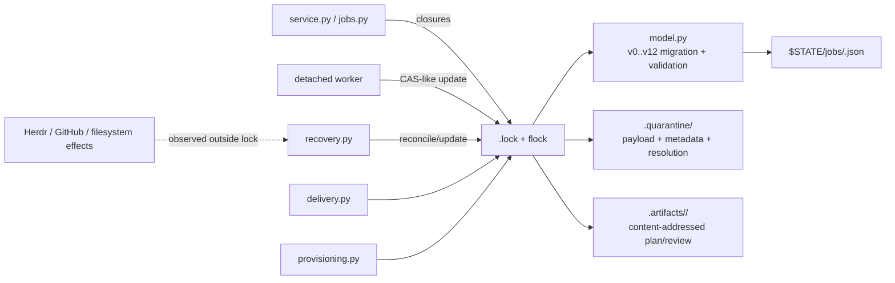
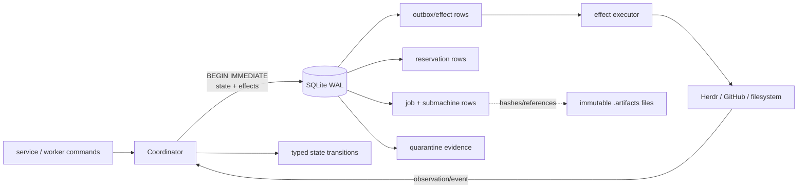

# Durable storage migration: JSON jobs to SQLite

This is the design/inventory for [#139](https://github.com/joshua-mo-143/local-voice-harness/issues/139).
It is deliberately read/design-only: it does not change runtime code, `cursor/model.py`,
or the public `JobStore` API. The implementation phases are [#140](https://github.com/joshua-mo-143/local-voice-harness/issues/140),
[#141](https://github.com/joshua-mo-143/local-voice-harness/issues/141), and
[#142](https://github.com/joshua-mo-143/local-voice-harness/issues/142), in that order.

## Current state

`cursor/store.py` is the durable transaction boundary. A per-directory `flock`
serializes readers and writers; a candidate is parsed and normalized, compared
with the previous revision, checked against peer reservations and quarantine
evidence, then atomically replaced as JSON. `cursor/model.py` supplies v12
migration, typed conversion, transition validation, and cross-field invariants.
Recovery, service, provisioning, delivery, and worker lifecycle all submit
closures to that store boundary.



### JSON write-surface verification

The repository-wide search covered production Python under
`src/local_voice_harness/`, repository scripts, and service/CLI entry points
for JSON serialization, file writes, durable-job path constants, and
`JobStore` construction/calls. Tests were checked separately as fixtures and
fault-injection clients, not production writers. The result is:

* Job records, maintenance fences, quarantine metadata, quarantine resolution
  tombstones, and workflow-artifact sidecars are written by the private helpers
  in `cursor/store.py`.
* `cursor/jobs.py::write_job` is a compatibility facade; it delegates to
  `JobStore.create/update` and does not write JSON itself.
* `app.py`, `wake/daemon.py`, `cursor/worker.py`, and the agent-neutral
  `agents/store.py` facade construct or re-export `JobStore`; they do not write
  job JSON directly.
* `model.py`, `recovery.py`, `provisioning.py`, `worker_lifecycle.py`, and
  `questions.py` do not write persisted JSON files. `service.py` emits two
  diagnostic `json.dumps(...)` lines to stdout only.
* `recovery.py` and `provisioning.py` consume provider JSON returned by Herdr;
  that is not local persistence.
* Cursor worker logs are transient files under `$XDG_RUNTIME_DIR`; they are not
  job state.

Thus there are no hidden Cursor job JSON writers outside the documented store
paths. This statement is scoped to Cursor job durability; unrelated vocabulary,
plan-preference, audio, and service configuration JSON stores remain separate
and are not part of this migration.

### Current transition ownership

The existing implementation has one durable write boundary, but transition
decisions are distributed across these callers:

| Module | Transition decisions and durable responsibilities |
|---|---|
| `cursor/store.py` | Owns the lock, load/normalize/validate/write transaction, revision CAS, peer reservation checks, quarantine fencing, maintenance lease, delivery claim CAS, and artifact sidecars. |
| `cursor/model.py` | Owns typed conversion, v0–v12 normalization, legal status/workflow transitions, cross-field invariants, worker ownership validation, question validation, and delivery-state evolution. |
| `cursor/recovery.py` | Reconciles detached workers, external targets, forks, and worktrees from observations; requests state changes through `JobStore`. |
| `cursor/service.py` | Coordinates admission, cancellation, pruning, delivery orchestration, maintenance operations, and worker launch/recovery; it does not write job JSON directly. |
| `cursor/provisioning.py` | Coordinates fork/worktree/pane provisioning and records provider outcomes through store updates; reservation admission remains enforced by the store. |
| `cursor/delivery.py` | Owns the claim/renew/acknowledge/release protocol and playback ordering; the store persists the claim and terminal delivery state. |
| `cursor/worker_lifecycle.py` | Owns detached-process launch, process identity capture, checkpoints, and stop/reconcile observations; it does not decide domain transitions or write job JSON directly. |

The target coordinator consolidates these decisions without changing their
public entry points: callers submit commands or observations, and only the
coordinator performs the resulting durable transition.

## Target state

SQLite becomes authoritative for job state, reservations, claims, leases,
quarantine references, and pending effects. Large plan/review contents remain
immutable content-addressed files. A single coordinator owns transitions;
workers report observations and execute named effects.



The coordinator should preserve externally visible statuses and at-least-once
delivery. A crash after a transaction commits resumes from outbox rows; a crash
after an external effect but before its observation remains `OutcomeUnknown`
and is reconciled rather than blindly replayed.

### Target lifecycle boundaries

The top-level lifecycle is a sum type; fields belonging to another variant are
not nullable alternatives on the same state:

```text
Job =
  Queued(checkout)
  | CheckingOut(checkout, operation)
  | Running(session, checkout)
  | AwaitingQuestion(session, question)
  | AwaitingPrompt(session, prompt)
  | Reviewing(session, review)
  | Terminal(intent, delivery)
  | Reconciling(intent, external_operations)
  | Quarantined(evidence, reservations)
```

Each job owns independent submachines whose uncertainty is explicit:

* `Checkout`: `Unrequested | Provisioning | Ready | Failed | Unknown |
  ManualRequired`
* `Session`: `Absent | Starting | Active | Stopping | AbsentUnknown |
  | ManualRequired`
* `Prompt`: `Idle | Submitting | Submitted | OutcomeUnknown | Failed`
* `Question`: `None | Asked | Answered | Expired | Cancelled`
* `Delivery`: `NotReady | Ready | Claimed | Retryable | Delivered`

Commands are `Admit`, `StartCheckout`, `ReportCheckout`, `StartSession`,
`StopSession`, `SubmitPrompt`, `AskQuestion`, `AnswerQuestion`,
`PrepareTerminal`, `ClaimDelivery`, `AcknowledgeDelivery`, `ReleaseDelivery`,
`Reconcile`, and `AcknowledgeQuarantine`. Provider results are observations,
not transitions: they are accepted only when the operation idempotency key and
expected revision match the current row. A transition atomically updates the
top-level variant, affected submachine rows, reservations, an audit event,
and any resulting outbox effects.

## v12 persisted-field inventory

The four typed sets in `cursor/model.py` contain 158 scalar fields. The
structured v9+ layout additionally persists `voice_question`, whose value is
validated as a `Question` object rather than by one scalar type. `loaded_schema_version`
is an in-memory provenance value and is **not** a persisted field.

| Classification | Every v12 field | Proposed treatment |
|---|---|---|
| Boolean (21) | `agent_dispatch_exited`, `announcement_dismissed`, `announcement_repeated`, `cancellation_reconciliation_pending`, `continuation`, `delivered`, `fork_committed`, `fork_confirmed`, `fork_dispatch_exited`, `fork_exists`, `fork_operation_source_private`, `fork_requested`, `interactive_questionnaire_blocked`, `phase_prompt_active`, `plan_approval_completion_pending`, `plan_approval_counted`, `reconcile`, `review_approved`, `target_release_pending`, `worktree_dispatch_exited`, `worktree_manual_inspection_required` | `INTEGER NOT NULL CHECK (value IN (0,1))`; move compatibility `phase_prompt_active` to import-only after #142 |
| Integer (20) | `agent_absent_observations`, `agent_reconcile_attempts`, `delivery_attempts`, `delivery_generation`, `fork_absent_observations`, `fork_reconcile_attempts`, `github_issue`, `github_pull_request`, `plan_approval_revision`, `plan_approval_state_change_sequence`, `prompt_baseline_sequence`, `prompt_operation_turn`, `review_round`, `revision`, `schema_version`, `target_release_owner_pid`, `turn`, `worker_pid`, `worktree_absent_observations`, `worktree_reconcile_attempts` | `INTEGER`; non-negative checks for counters/revision/rounds; nullable for optional identities |
| Float/timestamp (31) | `agent_automatic_reconcile_stopped_at`, `agent_confirmed_absent_at`, `agent_last_reconciled_at`, `agent_next_reconcile_at`, `agent_retained_at`, `attempt_started_at`, `completed_at`, `created_at`, `delivered_at`, `delivery_claimed_at`, `delivery_retry_at`, `foreground_until`, `fork_automatic_reconcile_stopped_at`, `fork_committed_at`, `fork_confirmed_absent_at`, `fork_last_reconciled_at`, `fork_next_reconcile_at`, `fork_retained_at`, `manual_reconcile_required_at`, `manual_reconcile_resolved_at`, `next_reconcile_at`, `queued_at`, `started_at`, `terminal_intent_completed_at`, `updated_at`, `worktree_automatic_reconcile_stopped_at`, `worktree_confirmed_absent_at`, `worktree_last_reconciled_at`, `worktree_next_reconcile_at`, `worktree_quarantine_acknowledged_at`, `worktree_retained_at` | `REAL`; finite-value checks at the adapter boundary; use UTC epoch seconds consistently |
| String/enum (86) | `active_participant`, `agent_dispatch_state`, `agent_hint`, `agent_name`, `clarification_kind`, `context_repository`, `continuation_answer`, `delivery_claim_token`, `error`, `fork_operation_login`, `fork_operation_source`, `fork_operation_source_default_branch`, `fork_operation_source_parent`, `fork_operation_source_url`, `fork_operation_state`, `fork_operation_target`, `fork_repository`, `github_issue_context`, `github_issue_url`, `github_repository`, `harness_kind`, `herdr_pane_id`, `herdr_target`, `herdr_workspace_id`, `id`, `implementer_target`, `issue_key`, `manual_reconcile_operation`, `manual_reconcile_outcome`, `manual_reconcile_token`, `parent_job_id`, `participant_creation_label`, `participant_creation_pane_id`, `participant_creation_participant`, `participant_creation_state`, `participant_creation_target`, `participant_creation_workspace_id`, `plan_approval_agent_session`, `plan_approval_id`, `plan_approval_source`, `plan_approval_state`, `plan_artifact`, `planner_target`, `prompt_operation_phase`, `prompt_operation_state`, `prompt_operation_target`, `pull_request_branch`, `pull_request_worktree_error`, `pull_request_worktree_state`, `question`, `reconciliation_base_error`, `repository`, `repository_hint`, `request`, `result`, `review_approval_source`, `review_artifact`, `review_decision`, `reviewer_target`, `session_id`, `speakable_label`, `status`, `target_release_owner_boot_id`, `target_release_owner_start`, `target_release_token`, `terminal_intent_error`, `terminal_intent_result`, `terminal_intent_status`, `trusted_utterance`, `turn_token`, `utterance`, `worker_boot_id`, `worker_operation`, `worker_process_start`, `worker_token`, `workflow_classification_reason`, `workflow_phase`, `workflow_tier`, `workflow_turn_phase`, `worktree_branch`, `worktree_label`, `worktree_path`, `worktree_provision_error`, `worktree_provision_state`, `worktree_root_pane_id`, `worktree_workspace_id` | `TEXT`; use lookup/check constraints for finite enums; secrets/tokens remain opaque |
| Structured payload (1) | `voice_question` | Separate `question` row or canonical JSON column during #140; #141 makes it a typed question submachine. Keep a canonical serialized copy only at the adapter edge, not as the lifecycle source of truth |

The model also has compatibility aliases and structured input containers
(`harness_state`, `checkout_state`, `provider_state`) that are import/serialization
layouts, not additional v12 fields. `schema_version` is retained by #140 for
import parity and becomes an SQLite schema/import version, not a per-job
compatibility mechanism after #142.

### Exhaustive migration disposition

During #140 all 159 persisted values remain lossless in the validated
`payload_json` parity envelope. The list below assigns every value exactly once
to its final #141/#142 disposition; "side table" means typed columns rather
than a generic JSON lifecycle blob.

| Final disposition | Persisted fields |
|---|---|
| Core `jobs` row (21) | `id`, `parent_job_id`, `harness_kind`, `revision`, `status`, `request`, `utterance`, `trusted_utterance`, `created_at`, `updated_at`, `queued_at`, `started_at`, `completed_at`, `foreground_until`, `continuation`, `continuation_answer`, `reconcile`, `agent_hint`, `context_repository`, `repository_hint`, `speakable_label` |
| Workflow/review/approval side tables (20) | `workflow_tier`, `workflow_phase`, `workflow_classification_reason`, `workflow_turn_phase`, `active_participant`, `planner_target`, `reviewer_target`, `implementer_target`, `review_round`, `review_approved`, `review_approval_source`, `review_decision`, `plan_approval_state`, `plan_approval_id`, `plan_approval_agent_session`, `plan_approval_state_change_sequence`, `plan_approval_revision`, `plan_approval_source`, `plan_approval_counted`, `plan_approval_completion_pending` |
| Provider and checkout side tables (27) | `issue_key`, `github_repository`, `github_issue`, `github_issue_url`, `github_issue_context`, `github_pull_request`, `pull_request_branch`, `repository`, `worktree_branch`, `worktree_path`, `worktree_workspace_id`, `worktree_root_pane_id`, `worktree_label`, `pull_request_worktree_state`, `pull_request_worktree_error`, `fork_repository`, `fork_requested`, `fork_confirmed`, `fork_exists`, `fork_committed`, `fork_committed_at`, `fork_operation_source`, `fork_operation_source_private`, `fork_operation_source_url`, `fork_operation_source_default_branch`, `fork_operation_source_parent`, `fork_operation_login` |
| Session and worker-claim side tables (13) | `session_id`, `agent_name`, `herdr_target`, `herdr_pane_id`, `herdr_workspace_id`, `worker_token`, `worker_pid`, `worker_boot_id`, `worker_process_start`, `worker_operation`, `attempt_started_at`, `turn`, `turn_token` |
| Provider-operation side tables (43) | `agent_dispatch_state`, `agent_dispatch_exited`, `agent_absent_observations`, `agent_reconcile_attempts`, `agent_last_reconciled_at`, `agent_next_reconcile_at`, `agent_automatic_reconcile_stopped_at`, `agent_confirmed_absent_at`, `agent_retained_at`, `fork_operation_state`, `fork_operation_target`, `fork_dispatch_exited`, `fork_absent_observations`, `fork_reconcile_attempts`, `fork_last_reconciled_at`, `fork_next_reconcile_at`, `fork_automatic_reconcile_stopped_at`, `fork_confirmed_absent_at`, `fork_retained_at`, `worktree_provision_state`, `worktree_provision_error`, `worktree_dispatch_exited`, `worktree_absent_observations`, `worktree_reconcile_attempts`, `worktree_last_reconciled_at`, `worktree_next_reconcile_at`, `worktree_automatic_reconcile_stopped_at`, `worktree_confirmed_absent_at`, `worktree_retained_at`, `worktree_manual_inspection_required`, `worktree_quarantine_acknowledged_at`, `participant_creation_state`, `participant_creation_participant`, `participant_creation_target`, `participant_creation_label`, `participant_creation_workspace_id`, `participant_creation_pane_id`, `prompt_operation_state`, `prompt_operation_phase`, `prompt_operation_turn`, `prompt_operation_target`, `prompt_baseline_sequence`, `next_reconcile_at` |
| Question side table (4) | `question`, `voice_question`, `clarification_kind`, `interactive_questionnaire_blocked` |
| Delivery and terminal-intent side tables (15) | `delivered`, `delivered_at`, `delivery_attempts`, `delivery_generation`, `delivery_claim_token`, `delivery_claimed_at`, `delivery_retry_at`, `announcement_dismissed`, `announcement_repeated`, `result`, `error`, `terminal_intent_status`, `terminal_intent_result`, `terminal_intent_error`, `terminal_intent_completed_at` |
| Reconciliation and release side tables (12) | `cancellation_reconciliation_pending`, `manual_reconcile_operation`, `manual_reconcile_outcome`, `manual_reconcile_token`, `manual_reconcile_required_at`, `manual_reconcile_resolved_at`, `reconciliation_base_error`, `target_release_pending`, `target_release_token`, `target_release_owner_pid`, `target_release_owner_boot_id`, `target_release_owner_start` |
| File-backed artifacts with SQLite metadata (2) | `plan_artifact`, `review_artifact` become foreign-key references to `artifacts`; immutable artifact bytes remain content-addressed files |
| Import-only, then delete (2) | `schema_version` selects the one-shot importer and becomes store metadata; `phase_prompt_active` is a compatibility alias. Neither remains on the typed job after #142 |

### Invalid combinations and typed replacements

The following list covers the cross-field and transition checks currently
performed by `CursorJob.from_dict`, `validate_invariants`,
`validate_transition`, and `validate_reservations`. Primitive parsing checks
(field type, finite number, JSON shape, and enum membership) remain adapter
validation rather than lifecycle states.

| Invalid combination rejected today | Typed-state or coordinator replacement |
|---|---|
| A status lacks its required payload or timestamp: queued without `queued_at`; awaiting-user without question/result; blocked/completed/cancelled without result; failed without error/result; terminal without `completed_at` | Constructors for `Queued`, `AwaitingQuestion`, and each `Terminal` result variant require their payload and timestamp; absent fields cannot be constructed |
| Identity, creation time, parent, or harness changes; revision does not advance by one; status/workflow phase takes an illegal edge; workflow tier is downgraded | Immutable `JobIdentity` plus command-specific transition functions; coordinator CAS increments revision and transition tables expose only legal edges |
| A follow-up changes inherited repository, branch, path, workspace, or root pane | Immutable `CheckoutSnapshot` is copied when the child and its reservation are created in one transaction |
| Worker token/PID/boot/process-start is partial, a worker state has no complete owner, or PID is non-positive | `WorkerClaim` is either `Unclaimed` or `Claimed(token, ProcessIdentity, operation, claimed_at)`; no partial representation |
| Delivery token and claim time are unpaired, or a delivered job retains a live claim | `Delivery = Ready | Claimed(token, claimed_at, lease, generation) | Retryable | Delivered(delivered_at)` |
| Workflow is classified without tier/reason, simple enters planning/review, medium exceeds one review, revising remains at round two, or round is outside 0–2 | `Workflow` variants carry classification proof; tier-specific transition tables constrain phases and review-round constructors constrain range |
| Review approval/source are unpaired; approval lacks an artifact; reviewer approval lacks an approve decision; user override is not an exhausted high-risk rejection; approved artifacts do not match the current round | `Review = Pending | Rejected | Approved(ApprovalProof, PlanArtifact, ReviewArtifact, round)` with distinct reviewer and high-risk user-override proof variants |
| Plan approval retains proof while inactive, lacks complete proof while active, appears in the wrong phase/status, is counted without explicit acceptance, or marks completion without durable finished output | `PlanApproval = None | Boundary | Awaiting(QuestionRef, GateProof) | Approved(ApprovalProof) | Observed(ApprovalProof) | Rejected`; workflow commands control allowed embeddings |
| A planned medium/high-risk workflow implements without current approved plan/review artifacts and plan approval | `Implementing` constructor requires an `ApprovedPlan` aggregate referencing matching immutable artifacts and approval proof |
| Active participant target differs from the session target; participant creation lacks role/target/label or a created pane lacks workspace/pane IDs | `ParticipantCreation = None | Creating(ParticipantSpec) | Created(ParticipantSpec, PaneIdentity) | OutcomeUnknown | ManualRequired`; active participant references the created session target |
| Prompt operation lacks phase/turn/target, or a submitting/submitted/ambiguous prompt lacks baseline sequence | `Prompt = Idle | Submitting(PromptSpec, baseline) | Submitted(PromptSpec, baseline) | OutcomeUnknown(PromptSpec, baseline) | Failed` |
| Agent, fork, or worktree operation is uncertain without its target/spec; worktree provisioning lacks repository/branch/path | Operation variants carry their required `SessionTarget`, `ForkSpec`, or `CheckoutSpec`; uncertain outcomes retain the same operation identity |
| Terminal intent exists outside reconciling/release-fenced state; target release owner identity is partial or remains after release | `Reconciling(TerminalIntent, TargetReleaseLease)` requires a complete process identity; confirmation transitions atomically to `Terminal` and removes the lease |
| Manual reconciliation operation/token/state disagree; cancellation reconciliation has no uncertain operation/release fence or an incompatible status | `ManualRequired(OperationRef, token)` and `CancellationReconciling(TerminalIntent, NonEmptySet[OperationRef])` encode the fence directly |
| Artifact reference has the wrong job/kind/round, or approved plan/review artifacts do not share the active round | `ArtifactRef(job_id, kind, round, digest)` is validated on insertion; foreign keys and the `ApprovedPlan` constructor bind matching references |
| Two jobs reserve the same ticket, target, or worktree, including unresolved quarantine evidence | Unique reservation rows are inserted in the same transaction as the state change; quarantine owns reservation rows until hash-bound acknowledgement |

## Invariants to preserve

| Existing invariant | SQLite/coordinator mapping |
|---|---|
| Exclusive per-store lock | One coordinator connection; WAL for readers, `BEGIN IMMEDIATE` for every state/effect transaction. A short migration/maintenance lease fences old writers. |
| Revision CAS | `jobs.revision` increments exactly once per transition. Update uses `WHERE job_id = ? AND revision = ?`; zero rows means stale command. |
| Legal job/workflow transitions | Typed transition functions and transition tables in #141; SQL checks only enforce local facts, never replace domain validation. |
| Typed/finite/JSON validation | Decode at the edge, validate enums and `Question`, reject non-finite numbers and unknown structured fields before a transaction. |
| Delivery claim ownership | `delivery_claim_token`, `claimed_at`, attempts, retry time, and generation are one claim row or one constrained submachine; acknowledge/release require the token and a live lease. |
| Worker ownership | Token, PID, boot ID, and process start are an all-or-none claim. PID is meaningful only with boot and process-start fences; worker checkpoints compare token/status/terminal intent. |
| Target release fence | A release row stores token plus owner PID/boot/start as a complete tuple. Terminal intent remains reconciling until external targets are confirmed or manually resolved. |
| Reservations | Materialized `reservations(resource_kind, resource_key, job_id)` rows with a unique `(resource_kind, resource_key)` index. Active, uncertain, manual, quarantined, and release-fenced jobs retain rows. |
| Ticket uniqueness | A partial unique index over canonical active GitHub/Linear ticket identity replaces peer scanning for active resource-owning jobs. |
| Follow-up checkout identity | Child has a parent foreign key and immutable repository/branch/path/workspace/pane snapshot; creation and reservation are one transaction. Parent stays terminal and unchanged. |
| External uncertainty | Operation rows use `planned`, `submitting/submitted`, `confirmed`, `ambiguous`, `manual_required`, or `confirmed_absent`; absence of evidence never implies absence. |
| Artifact integrity | SQLite stores immutable reference, digest, kind, round, and source-plan digest. Files remain exclusive-create and hash-verified; malformed files create quarantine rows. |
| Quarantine fail-closed | Quarantine evidence is durable and reservation-bearing until a hash-bound operator acknowledgement. It is never silently deleted by pruning or rollback. |
| Maintenance deletion | A maintenance lease has unique token and process identity. It blocks writes, requires no active workers/fences/legacy records/unresolved quarantine, then deletes in one controlled operation. |
| At-least-once delivery | Result state commits before speech; the effect is acknowledged only after playback. Crash/retry can repeat but cannot silently lose an undelivered terminal. |

## Proposed SQLite shape

SQLite should use `PRAGMA foreign_keys=ON`, WAL mode, a busy timeout, and
explicit transactions. Suggested logical tables (exact normalization can wait
for #141):

* `store_meta(key PRIMARY KEY, value TEXT NOT NULL)` — database format,
  importer status, source-directory fingerprint, and cutover marker.
* `jobs(job_id TEXT PRIMARY KEY, parent_job_id TEXT REFERENCES jobs,
  revision INTEGER NOT NULL, status TEXT NOT NULL, harness_kind TEXT NOT NULL,
  created_at REAL NOT NULL, updated_at REAL, payload_json TEXT NOT NULL)` —
  #140 may retain `payload_json` as a parity envelope, but it is transactionally
  updated and validated. #141 progressively moves lifecycle data into typed
  columns/tables; #142 removes the generic blob as source of truth.
* `workflow(job_id PRIMARY KEY REFERENCES jobs, tier, phase, classification_reason,
  review_round, active_participant, plan_artifact, review_artifact, review_decision,
  approval fields...)` with checks for tier/phase, round range, and approval proof.
* `questions(question_id PRIMARY KEY, job_id REFERENCES jobs, turn_token,
  owner, state, kind, sensitivity, choices_json, answer_json, asked_at,
  answered_at)`; unique `(job_id, turn_token, question_id)` plus a partial
  unique index on `(job_id)` for rows in the current `Asked` state. Answered,
  expired, and cancelled rows remain as history.
* `operations(operation_id PRIMARY KEY, job_id REFERENCES jobs, kind, state,
  idempotency_key UNIQUE, target, baseline_sequence, attempts, next_at,
  manual_token, outcome, observed_at)` for agent, fork, worktree, prompt, and pane.
* `worker_claims(job_id PRIMARY KEY REFERENCES jobs, token UNIQUE, pid,
  boot_id, process_start, operation, claimed_at)` with either all identity
  columns populated or all null.
* `delivery(job_id PRIMARY KEY REFERENCES jobs, delivered INTEGER NOT NULL,
  generation, claim_token UNIQUE, claimed_at, retry_at, attempts, delivered_at)`;
  checks pair token/timestamp and forbid a live claim on delivered state.
* `reservations(resource_kind, resource_key, job_id REFERENCES jobs,
  reason, created_at, PRIMARY KEY(resource_kind, resource_key))`; resource kinds
  include `ticket`, `target`, and `worktree`.
* `artifacts(reference PRIMARY KEY, job_id REFERENCES jobs, kind, round,
  path, digest UNIQUE, source_digest, immutable INTEGER NOT NULL)` with checks
  tying kind/round/job to the reference.
* `quarantine(evidence_id PRIMARY KEY, job_id, original_name, payload_path,
  metadata_path, payload_digest, error, resolved_at, resolution_reason)` plus a
  unique unresolved evidence identity. Resolution never mutates the evidence.
* `maintenance(token PRIMARY KEY, operation, owner_pid, owner_boot_id,
  owner_process_start, started_at, lease_expires_at, active INTEGER NOT NULL)`
  with at most one active lease; every write verifies the active lease is not
  expired, and releasing it requires the complete owner identity tuple.
* `outbox(effect_id PRIMARY KEY, job_id REFERENCES jobs, kind, idempotency_key
  UNIQUE, payload_json, status, attempts, next_at, lease_token, leased_at,
  completed_at, outcome_json, last_error)`; effect status must distinguish
  pending, running, succeeded, failed-retryable, and unknown.
* `events(event_id PRIMARY KEY, job_id, revision, kind, payload_json, created_at)`
  for audit/recovery evidence; event insertion and state update are atomic.

SQL constraints should enforce identity, uniqueness, null pairing, booleans,
counter ranges, foreign keys, and immutable artifact identity. Domain-specific
transition and reservation decisions remain in typed coordinator code so the
database cannot accidentally encode an incomplete policy.

### Coordinator and effects

The durable API should conceptually be:

```text
command(job snapshot, expected revision)
  -> BEGIN IMMEDIATE
     validate command and current submachines
     write new state, event, reservations, and outbox effects
     COMMIT
  -> execute effects outside transaction
  -> report observation(effect id, idempotency key, outcome)
```

Effects are named and idempotent where the provider supports it: start/cancel
agent, create fork, create worktree, submit prompt, observe agent/worktree,
release target, publish artifact, and deliver/acknowledge result. An effect
executor must lease an outbox row, renew it, and report `Confirmed`,
`ConfirmedAbsent`, or `OutcomeUnknown`; it must not directly update `jobs`.

The Rust coordinator recommendation is intentionally non-blocking: evaluate a
small Rust process/library after the Python state model and SQLite schema have
stabilized. Rust is attractive for one-writer supervision, explicit enums,
crash-safe effect scheduling, and property testing, but it should not be a
prerequisite for #140 or #141. Keep SQLite and the provider-effect protocol
language-neutral so a later Rust coordinator can replace the Python one
without changing persisted semantics.

## One-shot JSON to SQLite migration

Migration is an import-on-first-open cutover, not a live dual-writer design.
Before cutover, stop or fence all harness daemons and workers, take a
byte-for-byte backup of the durable jobs directory and legacy runtime jobs
directory, and record paths, timestamps, hashes, and the current application
version.

1. Acquire the legacy and durable locks in the existing order. Create
   `jobs/jobs.sqlite3` inside the durable jobs directory with restrictive permissions,
   foreign keys, WAL, and a migration lease.
2. Inventory ordinary `*.json`, `.maintenance`, `.quarantine` payloads,
   metadata, resolution tombstones, and `.artifacts`. Do not follow symlinks.
3. Import unresolved quarantine evidence before importing reservation-bearing
   rows. Preserve its payload, metadata, digest, error, and resolution status.
   Any candidate competing with unresolved evidence remains fenced.
4. Parse each job through the existing v12 `CursorJob.from_dict` path, apply
   legacy v0–v11 normalization, verify filename/job identity, and validate
   artifacts and reservations. Import valid rows with their original revision,
   timestamps, delivery state, worker identity, and quarantine references;
   reservation insertion is rejected if it conflicts with imported unresolved
   evidence.
5. Import undelivered terminals without pruning or coalescing them. Preserve
   terminal intent/reconciliation rows, delivery generation, retry/claim
   metadata, questions, and result/error text. Do not mark playback delivered.
6. Handle active jobs fail-closed. Inspect each worker using boot ID, process
   start, PID, and command identity. If safely absent/stopped, import as queued
   with the existing reconciliation semantics. If ownership or stopping is
   unsafe, preserve the JSON source and quarantine the import; do not attach the
   current boot to a legacy claim.
7. Import legacy runtime jobs exactly once. Same identity and revision with
   identical canonical content is idempotent; a newer durable row wins and the
   source is retained only until verified; same-revision disagreement or
   identity/created-at conflict is quarantined. Unsafe legacy worker claims
   remain blocked and their source is not deleted.
8. Insert rows, reservations, events, and import-status metadata in one
   transaction per bounded batch (or one transaction for the initial cutover).
   Commit a manifest containing source hashes, row counts, quarantine counts,
   and database schema version. Only after commit, rename imported job JSON to
   an archival suffix or move it to a migration backup; never destroy the
   backup as part of import.
9. Set the cutover marker atomically. New runtime opens use SQLite; a second
   open sees the completed manifest and performs no import. A partial import
   without a committed marker is discarded or resumed from the manifest while
   the JSON source remains authoritative.

### Backup and manual recovery

Stop the wake service and all detached workers before a manual backup or restore.
This drains writers and avoids copying a database while a delivery or release lease
is changing:

```fish
voice-harness services stop
set state_home "$HOME/.local/state"
if set -q XDG_STATE_HOME
    set state_home "$XDG_STATE_HOME"
end
set jobs_root "$state_home/voice-harness/jobs"
cp -a "$jobs_root" "$jobs_root.backup-"(date +%Y%m%d-%H%M%S)
```

For the systemd service, obtain the absolute `STATE_DIRECTORY` from
`systemctl --user show voice-harness-wake.service --property=Environment` and use
its `jobs` child instead. A complete backup includes `jobs.sqlite3`, any
`jobs.sqlite3-wal`/`jobs.sqlite3-shm` files present after shutdown, `.artifacts`,
`.quarantine`, and archived `*.json.imported`/`*.json.failed` sources. Do not back
up only the database: artifact bytes and quarantine payloads intentionally remain
file-backed.

`voice-harness doctor` reports the database path, schema version, migration status,
integrity result, and unresolved import failures without opening the store for
writes. If it reports an unreadable database or failed integrity check, leave the
services stopped, copy the entire jobs directory for forensics, and restore the
most recent complete directory backup. Do not delete WAL files, clear reservations,
mark results delivered, or copy selected rows between databases. Inspect unresolved
quarantine with `voice-harness jobs quarantine list`; acknowledge a reservation
only after verifying its worker, Herdr target, and worktree no longer exist.

### Rollback

Rollback is available only before SQLite has become the sole writer or after a
controlled drain. Stop the coordinator/effect executor, acquire the migration
lease, and verify no post-cutover effects are still running. Export SQLite rows
back to the original v12 structured JSON format only if every row has a
lossless representation; otherwise keep the original backup as the rollback
source and mark the database unusable. Restore the backed-up jobs directory,
legacy directory, quarantine evidence, and artifact references, then remove the
cutover marker and restart the prior JSON implementation.

Do not roll back by blindly copying SQLite over JSON: it can lose newly
delivered/undelivered results or resurrect external effects. Any effect with
`OutcomeUnknown` must be reconciled manually before rollback; outbox rows that
were executed are evidence, not permission to replay. If rollback is required
after new SQLite-only state exists, quarantine the database and retain it for
forensics, preserve all external resources, and require an operator decision
for each active reservation.

## Explicit non-goals

* No runtime implementation or `cursor/model.py` refactor in #139.
* No product-policy change for planning, review, plan approval, cancellation,
  fork confirmation, worktree retention, or delivery.
* No rewrite of wake, STT, TTS, audio, Herdr, GitHub, or provider integrations.
* No durable multi-ticket batch admission, UI/overlay work, or OpenCode
  implementation.
* No deletion of schema migration/compatibility code before #142 proves the
  one-shot importer and rollback path.
* No generic JSON blob remaining as the final source of truth after #142.
* No automatic deletion of quarantine evidence, generated worktrees, or
  undelivered terminals.
* No assumption that an external effect is absent because an observation failed.

## Open questions

1. Should #140 use a parity `payload_json` column temporarily, or split all 158
   scalar fields immediately while preserving the old adapter?
2. Which process is the coordinator at cutover: wake daemon, a dedicated
   supervised service, or a library-owned single process?
3. Should outbox leasing be strictly single-consumer, or support multiple
   effect executors with per-provider concurrency limits?
4. What provider idempotency guarantees exist for Herdr pane creation, prompt
   submission, fork creation, and worktree creation?
5. Should events be retained forever, sampled, or pruned separately from job
   retention?
6. What is the authoritative artifact backup/restore policy, and should
   artifact bytes eventually move into a separate content store?
7. How should SQLite backups be coordinated with WAL checkpoints and active
   effect leases?
8. Which migration failure categories are operator-retryable versus permanent
   quarantine, and what CLI diagnostics are required?
9. Is a Rust coordinator worth the operational boundary once Python transition
   property tests and hardware recovery checks pass?

## Phased checklist

### #139 — inventory and design

- [x] Inventory v12 persisted fields, structured payloads, state transitions,
  locks, CAS, reservations, worker identity, delivery, quarantine, and artifacts.
- [x] Verify the Cursor job JSON write surface and document non-job JSON stores.
- [x] Define SQLite tables, constraints, submachines, outbox effects, migration,
  rollback, non-goals, and open questions.
- [x] Link the design to [#138](https://github.com/joshua-mo-143/local-voice-harness/issues/138)
  and its ordered implementation phases.

### #140 — SQLite parity

- [ ] Add SQLite-backed `JobStore` behind the existing API; do not refactor
  `model.py` yet.
- [ ] Preserve locks/maintenance behavior with a migration lease and diagnostics.
- [ ] Implement one-shot import for durable JSON, legacy JSON, maintenance,
  quarantine, and artifact metadata.
- [ ] Prove parity for CAS, reservations, delivery claims, follow-ups, active
  worker recovery, undelivered terminals, pruning, and quarantine.
- [ ] Add backup, import-failure, rollback, and DB-path documentation.

### #141 — typed lifecycle and submachines

- [ ] Replace the optional-field lifecycle with typed top-level states.
- [ ] Extract checkout, agent ownership, prompt, question, and delivery
  submachines with explicit uncertainty states.
- [ ] Move cross-field invariants into transitions/types and retain SQL checks
  only for local relational facts.
- [ ] Preserve externally visible statuses and existing safety behavior.

### #142 — coordinator and outbox

- [ ] Make the coordinator the sole durable state writer.
- [ ] Persist `(state transition, event, reservations, outbox effects)` atomically.
- [ ] Execute named provider effects outside transactions with idempotency keys,
  leases, observations, and `OutcomeUnknown` recovery.
- [ ] Remove per-job JSON writes, compatibility layout, and v0–v11 incremental
  migration only after parity and hardware recovery checks pass.
- [ ] Re-evaluate the non-blocking Rust coordinator option after the Python
  model and effect boundary stabilize.
